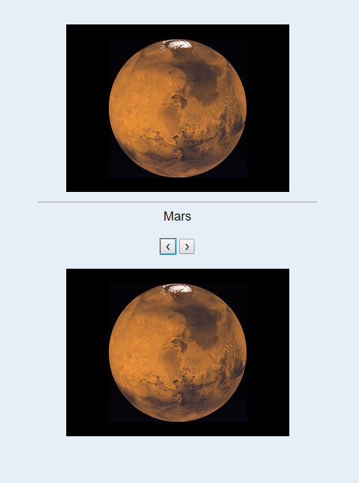
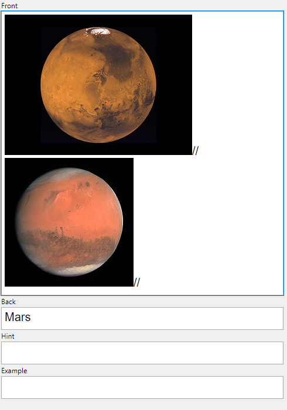

# Content

<!--TOC-->

- [Sequence Of Questions](#Anki-Sequence-Of-Questions)
  - [Example apkg](#Example-apkg)
  - [How to use](#How-to-use)
- [Typebox](#Anki-Typebox)
<!--TOC-->

# Anki Sequence Of Questions

This card-template makes it possible to have multiple question for one answer. The question is chosen randomly. This could be very useful in different situations. For example if you want to learn to **recognize** a planet (see the example .apkg) or for math problems:

> Question:How many possibilities are there to arrange n objects in a row? // Anton, Berta, Casar have to line up one by one. How many possibilities are there?

> Answer: n!

You dont need any plugins. Therefore it should works everywhere.

## Example apkg

|  |  |
| ---------------------------------- | ---------------------------------------- |

### How to use

Download the Template and divide your questions by tipping „//“

# Anki Typebox

The template is ready to use.
<<<<<<< HEAD
Perhaps this does not yet work optimally on mobile phones.
=======
<<<<<<< HEAD
Perhaps this does not yet work optimally on mobile phones.
=======
>>>>>>> 420727fde2691e594566117566cc69f604fdd707
>>>>>>> 2e4335a94c645e95c3f9f8f6300ce07ef8c214c2

# Acknowledgements

- [Simon Lammer](https://github.com/SimonLammer/anki-persistence), whose code make this possible
