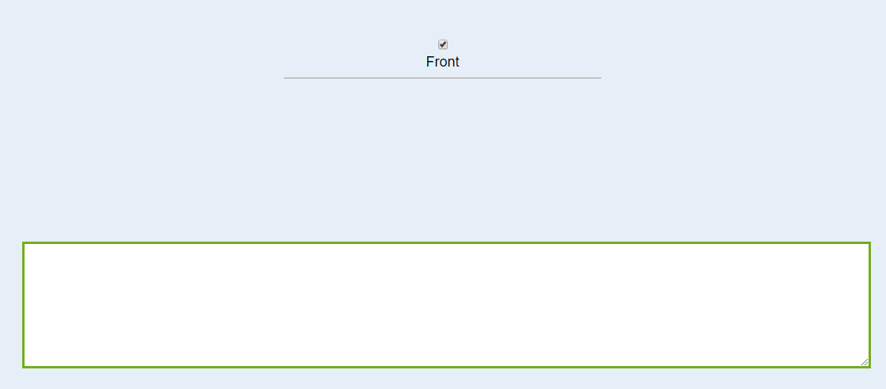

# Content

<!--TOC-->

- [Sequence Of Questions](#Anki-Sequence-Of-Questions)
- [Typebox](#Anki-Typebox)
- [Random list](#Random-list)
- [Acknowledgements](#Acknowledgements)
<!--TOC-->

# Anki Sequence Of Questions

This card-template makes it possible to have multiple question for one answer. The question is chosen randomly. This could be very useful in different situations. For example if you want to learn to **recognize** a planet (see the example .apkg) or for math problems:

> Question:How many possibilities are there to arrange n objects in a row? // Anton, Berta, Casar have to line up one by one. How many possibilities are there?

> Answer: n!

You dont need any plugins. Therefore it should works everywhere.

## How to use

Divide your questions with `//`

|  |  |
| ---------------------------------- | ---------------------------------------- |

# Anki Typebox

The template is ready to use.
Perhaps this does not yet work optimally on mobile phones.

# Random list
Lists are shuffled.

## How to use

Start/End a list with `--`. The list entries are divided with `//`.

**Example:**

    Text that has nothing to do with the list.

    --
    // - list element
    // - another one
    // - more
    --
    
    More text that stays as it is 

# Acknowledgements

- [Simon Lammer](https://github.com/SimonLammer/anki-persistence), whose code make this possible
